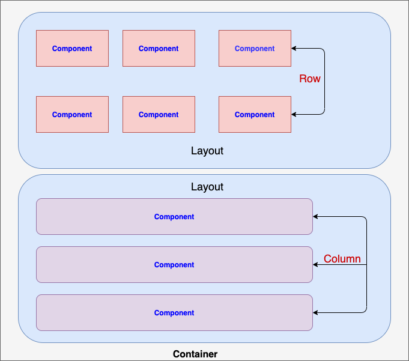

# FalconCore

## Build

Run `ng build @falcon-ng/core` to build the project. The build artifacts will be stored in the `dist/` directory.

## Running unit tests

Run `ng test @falcon-ng/core` to execute the unit tests via [Karma](https://karma-runner.github.io).

## Layout design



## Angular Dynamic Forms

* Check the [Demo](https://anandjaisy.github.io/Angular-Dynamic-Form-Builder/). 

## In Production
* Add the dependencies to the project `npm i @falcon-ng/core`
    ### Publish to NPM 
    * `ng build @falcon-ng/core --prod`
    * `npm login`
    * From the project root folder: `cd dist/@falcon-ng/core`
    * `npm publish --access public` access public is for free version
    ### To unplish the package from NPM
    * `npm unpublish @falcon-ng/core@<version>`
    * If publish error or previous version try the below command
        ```
        npm unpublish --force @falcon-ng/core@0.0.1
        npm publish --force --access public
        ```

## In Development
* During development the best way to consume library is using `npm link`
    ``` 
        cd dist/@falcon-ng/core
        npm link
    ```
* We can link an Angular project to this library from anywhere on local machine. From the project root folder:
    ``` 
        npm link @falcon-ng/core
    ```
* If we now build the library with the watch flag `ng build @falcon-ng/core --watch`, and at the same time run `ng serve -o` to another   project in another terminal window.
* This will allow us to develop an application and (one or more) linked libraries simultaneously, and see the app recompile with each modification to the library’s source code.
* add `preserveSymlinks = true` to the `angular.json` located at the other project 
    ``` 
        {
            "architect": 
                {
                    "build": 
                        {
                            "builder": "@angular-devkit/build-angular:browser",
                            "options": {
                                "preserveSymlinks": true
                                }
                        }
                }
        } 
    ```
* Add falcol core module to the project 
    ``` 
    import { FalconCoreModule } from '@falcon-ng/core';
    import {environment} from "../environments/environment";
        @NgModule({
            declarations: [],
            imports:[
                FalconCoreModule.forRoot(environment)
            ],
            bootstrap: [AppComponent]
        })
    ```
## Publish code to GitHub
        
        ng build --prod --output-path docs --base-href /<project_name>/

        Example --> ng build --prod --output-path docs --base-href /Angular-Dynamic-Form-Builder/
* Reference - https://angular.io/guide/deployment